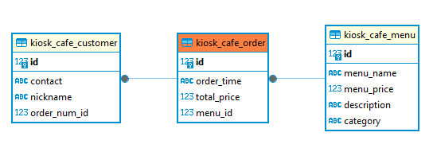

# django_kiosk
kiosk program using django

# 키오스크 프로그램
# Menus / Orders / Manages를 통해서 카페장사를 돕습니다.

##DB 관계도

##Menu 테이블은
menu_name, menu_price, description, category 4개의 column

##Order 테이블은
order_time, total_price, menu_id(Menu와 pk) 3개의 column

##Customer 테이블은
contact, nickname, order_num_id(Order와 pk) 3개의 column으로 이루어져 있습니다. 

